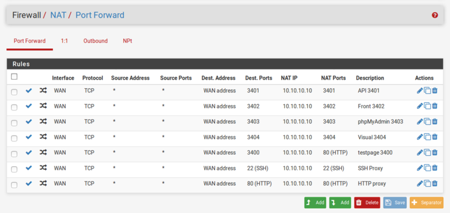



# Firewall Rules


## Wat
Om er voor te zorgen dat niet al het verkeer wordt geblokeerd door de firewall, moeten we enkel regels definieren. Deze regels verklaren wel verkeer toegelaten is van buitenaf, in dit geval http(s) queries naar de Proxy VM.

## Regels instellen 
Via de web interface kunnen we de regels instellen op eenvoudige wijze.
* Kies Firewall in het menu bovenaan
* kies vervolgens voor de optie NAT (Network address Translation)
* Standaard kom je op het tabblad portforwarding uit
* kies onderaan 'Add' om een nieuwe regel in te stellen
    * Duid het juiste transport protocol aan; TCP, UDP of TCP/UDP
    * Geef inkomende poort nummer in bij ```Destination port range```
    * Geef het forwarding IP bij ```Redirect Target IP```
    * Geef de uitgaande port nummer in bij ````Redirect Target Ports``` 
    * Het is handig als je ook een beschrijving meegeeft
* klik save en reload/refresh de configuration.



Op bovenstaande screenshot zie je de aanwezige regels die bepalen welk verkeer wordt tegelaten en geforward wordt naar de ingestelde IP's en Ports.


## Zie ook
* [Installatie pfSense](/{{site.RepoName}}/CCS/pfSense/)
* [Netwerk](/{{site.RepoName}}/CCS/Netwerk/)

## Bronnen 
* [pfSense in Proxmox guide ](https://docs.netgate.com/pfsense/en/latest/virtualization/virtualizing-pfsense-with-proxmox.html)
* [pfSense installation guide ](https://docs.netgate.com/pfsense/en/latest/install/installing-pfsense.html)



