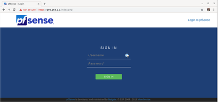
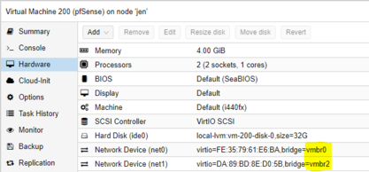




# pfSense


## Wat
pfSense is een gratis en open-source firewall gebasseerd op FreeBDS distro's. Je kan de firewall op fysieke als ook virtuele machines installeren en runnen. Na de installatie kan je de firewall beheren via een eenvoudige web-interface. pfSense firewall heeft een tal van opties om netwerken te beveiligen, onderandere
* DPI (Deep packet inspection)
* Intrusion Detection System
* Intrusion Prevention System
* Geo Blocking
* DNS sinkhole
* IP blacklists
* Additional applications en features  

## Installatie 
De installatie van pfSense is eenvoudig te doorlopen, wat wel voor enige verwaringen kan veroorzaken is de virtualaisiatie dat voor een extra laag van abstractie zorgt. Het belangrijkste is het juist toewijzen van de netwerk interfaces, namelijk de WAN aan de WAN kant en niet omgekeerd. De installatie zelf verloop via een aantal stappen
* Download de recenste stabiele versie als ISO file via de [website](https://www.pfsense.org/download/)
* Maak een nieuwe VM in Proxmox met ISO gemount, en start de VM
* Accepteer de voorwaarden en kies install
* Volg de default settings en installeer
* Na de installatie en heropstarten moet je de interfaces instellen via de CLI
    * via optie 1 stel je de WAN en LAN interfaces in (Kan via MAC address, identificeren, zie onder VM Netwerk Settings)
    * via optie 2 kan je installen welke IP's of DHCP settings de interfaces krijgen
        

* Nadien kan je via de LAN kant de web-interface bereiken via het IP van de LAN interface


## Proxmox bijkomende instellingen
Om de installatie en correcte werking van pfSense te garanderen moeten we volgende de volgende netwerk instellingen in proxmox maken. Nadien moeten we ook binnen pfSense nog een optie aanpassen om de virtuele werking te garanderen. 

### Proxmox network settings
De firewall VM heeft 2 netwerk interfaces toegewezen krijgen binnen Proxmox. Binnen Proxmox moeten we 2 netwerken hebben, het eerste netwerk zullen we als het WAN netwerk gebruiken. Hiervoor kunnen we het default aanwezige netwerk gebruiken ```vmbr0```, dit is dus een netwerk dat fysiek op de Proxmox omgeving aangesloten is. Voor het LAN netwerk moeten we binnen Proxmox een 2de netwerk aanmaken ```vmbr2```, echter koppelen we hier geen fysieke interface aan. Het is dus een netwerk dat enkel virtueel aanwezig is binnen de Proxmox omgeving. Enkel VM's met een interface van dit netwerk zijn verbonden met dit netwerk. 


_Fysieke interface eno3 is niet aangesloten op de Proxmox server_

### VM netwerk settings
Op de pfSense VM moeten we 2 netwerk interfaces toewijzen:
* 1 WAN Interface ```vmbr0```
* 1 LAN Interface ```vmbr2```



Hier kan je ook de bijhorende Mac addressen bekijken om te bepalen welke interface je binnen pfSense moet instellen als WAN of LAN.

### pfSense Settings
Binnen pfSense moeten we één instelling wijzigen om de werking binnen een virtuele omgeving te garanderen en optimalizeren. Deze instelling kan je via de Web-interface aanpassen onder; 
* Systeem > Advanced 
* Tabblad Networking
* Onderaan de pagina > Disable hardware checksum offload


Schakkel deze optie aan, dit zorgt er voor dat de checksum niet door de netwerk kaart gebeurdt, maat door de VM zelf. Moest dit op de netwerkkaart zelf gebeuren kan dit voor problemen zorgen door incompatible drivers en zo voort.

## Zie ook
* [Configuratie Rules](/{{site.RepoName}}/CCS/pfSense/Config)
* [Netwerk](/{{site.RepoName}}/CCS/Netwerk/)

## Bronnen 
* [pfSense in Proxmox guide ](https://docs.netgate.com/pfsense/en/latest/virtualization/virtualizing-pfsense-with-proxmox.html)
* [pfSense installation guide ](https://docs.netgate.com/pfsense/en/latest/install/installing-pfsense.html)


