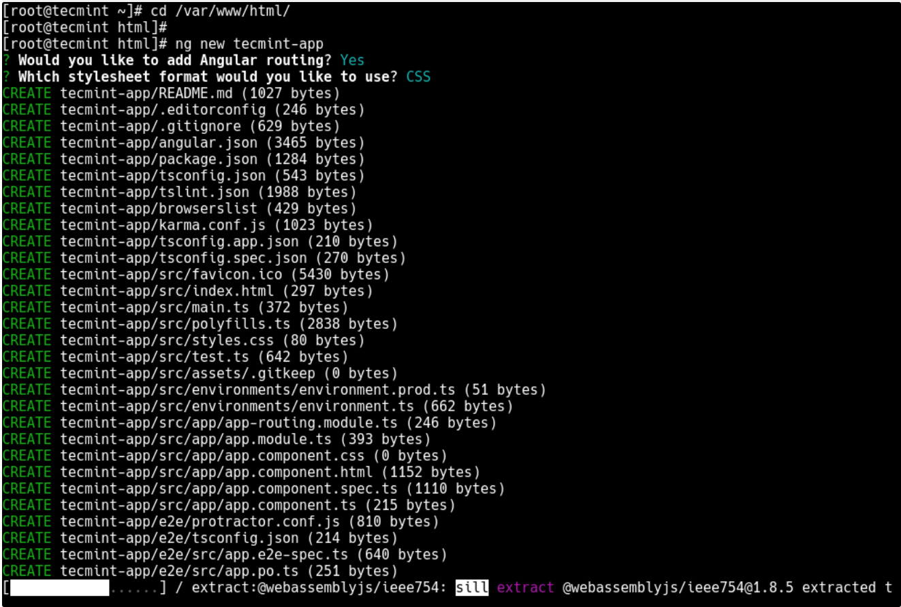




# Angular


## Wat

Angular is een open-source front-end applicatie-ontwikkelings platform dat gebruikt wordt om mobiele en webapplicaties te bouwen. Het is ideaal voor kleine en grotere applicaties. 

Belangrijk in gebruik is de Angular CLI; hieronder vind je alle stappen terug voor de volledige installatie.

## Installatie

### Installeer Node.js
```
sudo curl -sL https://deb.nodesource.com/setup_11.x | sudo -E bash –
```

### Development tools installeren
```
sudo apt install -y build-essential
```

### Installeer Angular CLI
```
sudo npm install -g @angular/cli
```

De installatie is nu in orde. Je kan de versie checken met volgend commando: ```ng --version ```

## Nieuw project aanmaken

### Eerst moet je in de root directory komen en een project initialiseren
```
cd /var/www/html
sudo ng new tecmint-app
```

Let hier ook op je antwoorden tijdens de prompting:



### Nu is er automatisch een 'application directory' aangemaakt en daar moet je je naar begeven.
```
cd tecmint-app
ls                 # list project files
ng serve
```
Met ‘ng serve’ zal de server de applicatie terug opbouwen en de webpagina herladen indien er veranderingen zijn aangebracht aan de source files.
Meer informatie over deze tool met ‘ng help’.

### Om de app via de browser te bereiken, moet poort 4200 openstaan. Indien de firewall actief is, dien je deze aan te passen.
```
sudo ufw allow 4200/tcp
sudo ufw reload
```

### Nu kan je via de browser je applicatie bereiken.
```
http://localhost:4200
of http://server-ip:4200
```
Je kan zelf ook een host en een poort instellen als je wilt afwijken van de standaardinstellingen. Bijvoorbeeld:
```
ng serve --host 192.168.3.125 --port 8080
```

## Bronnen 

* [Angular installation page](https://www.tecmint.com/install-angular-cli-on-linux/)

