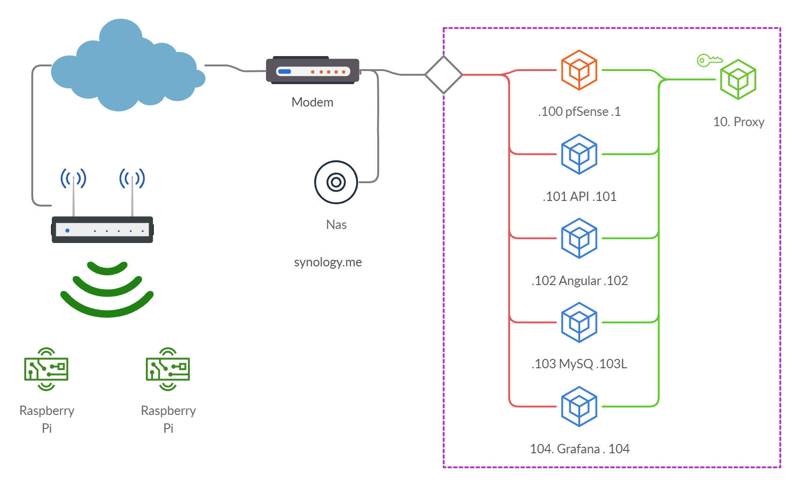



## Netwerk

## Netwerk
Om de werking van het netwerk duidelijk te maken, geven we graag even volgende toeliching op basis van bovenstaande afbeelding.
Via [DNS](../DNS) komen alle requests binnen op het publiek IP van de Proximus modem, van op de modem moeten alle request toegelaten worden en op de juiste plaats terecht komen. Via poortnummers en portforwarding gaan we de requests doorsturen naar de juiste plaats. Dit gebeurt op 3 plaatsen namelijk 
* Proximus modem (naar pfsense)
* pfSense (naar proxy)
* proxy (naar juiste VM)

### VMs

| VM           | Software     | int IP        | IP           |Link                                                    |
|--------------|--------------|---------------|--------------|--------------------------------------------------------|
| Firewall     | pfSense      | 192.168.3.100 | 10.10.10.1   |                                                        |
| Proxy        | Apache       | /             | 10.10.10.10  |[Web](https://rob-vl.synology.me:3400)                  |
| API          | ASP.net      | 192.168.3.101 | 10.10.10.101 |[API](https://rob-vl.synology.me:3401/swagger)          |
| Frontend     | Angularjs    | 192.168.3.102 | 10.10.10.102 |[Frontend](https://rob-vl.synology.me:3402)             |
| Database     | MySQL        | 192.168.3.103 | 10.10.10.103 |[phpmyadmin](https://rob-vl.synology.me:3403/phpmyadmin)|
| Visualisatie | Grafana      | 192.168.3.104 | 10.10.10.104 |[Grafana](https://rob-vl.synology.me:3404)              |

### Portforwarding Proximus modem

| Port | VM        | forward IP     | forward Port |
|------|-----------|----------------|--------------|
| 22   | Proxy     | 10.10.10.10    | 22           |
| 3400 | Proxy     | 10.10.10.10    | 3400         |
| 3401 | API       | 10.10.10.101   | 3401         |
| 3402 | Frontend  | 10.10.10.102   | 3402         |
| 3403 | Database  | 10.10.10.103   | 3403         |
| 3404 | Grafana   | 10.10.10.104   | 3404         |

### Portforwarding pfSense Firewall

| Port | VM        | forward IP     | forward Port |
|------|-----------|----------------|--------------|
| 22   | Proxy     | 10.10.10.10    | 22           |
| 80   | Proxy     | 10.10.10.10    | 80           |
| 3400 | Proxy     | 10.10.10.10    | 80           |
| 3401 | Proxy     | 10.10.10.10    | 3401         |
| 3402 | Proxy     | 10.10.10.10    | 3402         |
| 3403 | Proxy     | 10.10.10.10    | 3403         |
| 3404 | Proxy     | 10.10.10.10    | 3404         |

## 
* disable ipv6
* setup /etc/resolve
### h3

## zie ook 

## bronnen 


